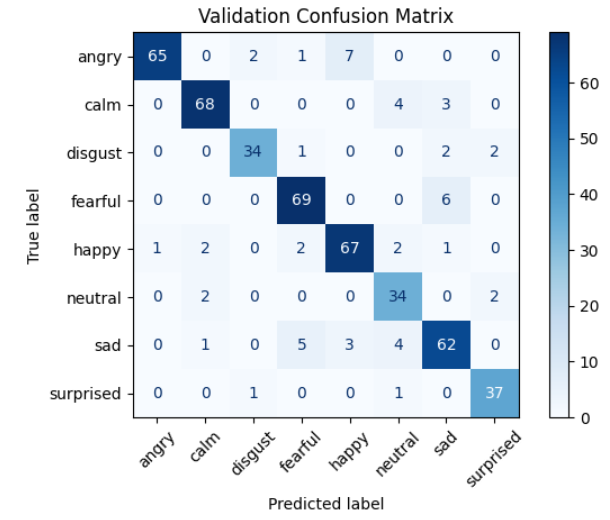
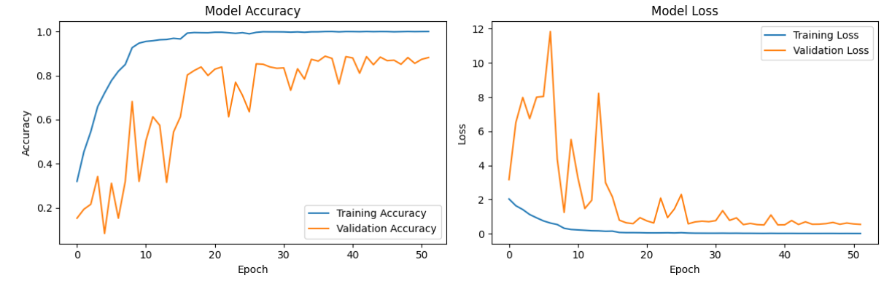

# Speech Emotion Classification

## Project Overview

A deep learning system that classifies human emotions from speech audio using Convolutional Neural Networks (CNN). The model can identify 8 different emotions from voice recordings with high accuracy.

**Supported Emotions:** Neutral, Calm, Happy, Sad, Angry, Fearful, Disgust, Surprised

---

## Model Performance

### Classification Matrix



### Loss Function Graph



---

## Approach

### Feature Extraction

- **MFCC (Mel-Frequency Cepstral Coefficients)**: Captures spectral envelope characteristics
- **Chroma Features**: Represents pitch class information
- **Spectral Features**: Rolloff, centroid, bandwidth for frequency analysis
- **Zero Crossing Rate**: Signal temporal characteristics
- **RMS Energy**: Audio signal power analysis

### CNN Architecture

1. **Input Layer**: Audio features with shape (features, time_steps, 1)
2. **Convolutional Blocks**: 3 blocks with 32, 64, 128 filters respectively
3. **Pooling & Normalization**: Max pooling and batch normalization
4. **Dense Layers**: Fully connected layers with dropout regularization
5. **Output Layer**: Softmax activation for 8-class classification

---

## Project Setup

### Installation

```bash
# Clone the repository
git clone <repository-url>
cd emotion-classification-speech

# Install dependencies
pip install -r requirements.txt
```

### Run the Application

```bash
# Start Streamlit web app
streamlit run app.py

# Test the model on audio files
python test_model.py --test_dir /path/to/audio/files --model_path final_emotion_model.h5
```

### Testing the Model

The `test_model.py` script allows you to evaluate the model on your own audio files:

```bash
python test_model.py --test_dir <audio_directory> [--model_path <model_file>] [--encoder_path <encoder_file>]
```

**Arguments:**

- `--test_dir`: Directory containing audio files to test (required)
- `--model_path`: Path to the model file (default: final_emotion_model.h5)
- `--encoder_path`: Path to label encoder (default: label_encoder.pkl)

**Example:**

```bash
python test_model.py --test_dir ./test_audio --model_path final_emotion_model.h5
```

### Project Structure

```
├── app.py                    # Streamlit web application
├── emotion-classification.ipynb  # Training notebook
├── test_model.py            # Model testing script
├── final_emotion_model.h5   # Trained model
├── label_encoder.pkl        # Label encoder
└── requirements.txt         # Dependencies
```

---

## Usage

1. **Web Interface**: Upload audio files or record voice directly
2. **Batch Testing**: Process multiple audio files using test script
3. **Real-time Analysis**: Get instant emotion predictions with confidence scores
